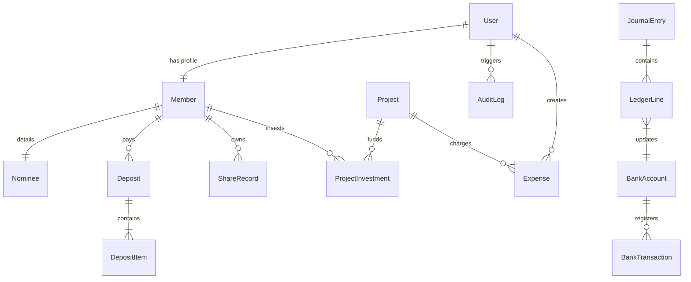

# Domain Model & ERD Specification
## Document Path: `docs/architecture/domain-model.md`

This document defines the Domain-Driven Design (DDD) model boundaries, structural entities, value objects, domain events, and the logical Entity-Relationship Diagram (ERD) mapping the Cooperative Society database schemas.

---

## 1. Domain Driven Design (DDD) Definitions

### 1.1 Core Aggregates

#### Member Aggregate
*   **Root Entity**: `Member`
*   **Child Entities**: `Nominee`
*   **Value Objects**: `PhoneNumber`, `EmailAddress`, `MailingAddress`
*   **Invariants**:
    *   Member phone number must be unique across the active database directory.
    *   If a Member is suspended, their account login permissions are revoked.

#### Financial Ledger Aggregate
*   **Root Entity**: `JournalEntry`
*   **Child Entities**: `LedgerLine`
*   **Value Objects**: `CurrencyAmount` (stored in Integer format representing BDT paisa/cents)
*   **Invariants**:
    *   The sum of debits must equal the sum of credits for every `JournalEntry` (Double-Entry integrity rule).

#### Project Investment Aggregate
*   **Root Entity**: `Project`
*   **Child Entities**: `ProjectInvestment`, `DividendDistribution`
*   **Invariants**:
    *   Project dividends are allocated strictly using members' capital ratio formulas:
        $$\text{Dividend} = \text{Total Profit} \times \left( \frac{\text{Member Investment}}{\text{Total Project Capital}} \right)$$

---

## 2. Entity-Relationship Diagram (ERD)

---

## 3. Database Schema Mapping (Prisma Definitions)

The database schema is mapped in PostgreSQL using the Prisma schema layout.

### 3.1 User Table (`User`)
Tracks auth accounts, login credentials, and permission profiles.

| Column | Data Type | Key / Constraint | Description |
| :--- | :--- | :--- | :--- |
| `id` | UUID | Primary Key | Unique user account ID |
| `email` | String | Unique | Login email username |
| `passwordHash` | String | Not Null | Password bcrypt hash |
| `role` | Enum | Not Null | Role: `SUPER_ADMIN`, `ACCOUNTANT`, `COLLECTION_OFFICER`, `MEMBER` |
| `createdAt` | DateTime | Default Now | Account registration timestamp |

### 3.2 Member Table (`Member`)
Tracks personal profiles and membership status.

| Column | Data Type | Key / Constraint | Description |
| :--- | :--- | :--- | :--- |
| `id` | UUID | Primary Key | Unique member registration ID |
| `userId` | UUID | Foreign Key | Link to `User.id` |
| `memberCode` | String | Unique | Generated Member ID (e.g. SOM-2026-0001) |
| `name` | String | Not Null | Member name |
| `phone` | String | Unique | Primary verification phone number |
| `email` | String | Nullable | Email address |
| `address` | String | Not Null | Mailing address |
| `joinDate` | DateTime | Not Null | Date member joined the society |
| `status` | Enum | Not Null | Status: `ACTIVE`, `INACTIVE`, `SUSPENDED` |
| `suspensionDate`| DateTime | Nullable | Date account was updated to suspended |

### 3.3 Nominee Table (`Nominee`)
Details of designated nominees for member estates.

| Column | Data Type | Key / Constraint | Description |
| :--- | :--- | :--- | :--- |
| `id` | UUID | Primary Key | Unique nominee record ID |
| `memberId` | UUID | Foreign Key (1-to-1) | Parent `Member.id` |
| `name` | String | Not Null | Nominee name |
| `relationship` | String | Not Null | Relationship to member |
| `phone` | String | Not Null | Contact phone number |
| `address` | String | Not Null | Address details |
| `emergencyContact`| String | Not Null | Secondary contact details |

### 3.4 Deposit Tables (`Deposit` & `DepositItem`)
Records bulk payment transactions.

#### Deposit
| Column | Data Type | Key / Constraint | Description |
| :--- | :--- | :--- | :--- |
| `id` | UUID | Primary Key | Unique deposit slip ID |
| `memberId` | UUID | Foreign Key | `Member.id` paying the bill |
| `receivedBy` | UUID | Foreign Key | `User.id` (Collection Officer) |
| `paymentMode` | Enum | Not Null | `CASH`, `BANK` |
| `receiptImage` | String | Nullable | Uploaded transaction slip path |
| `remarks` | String | Nullable | Comments |
| `createdAt` | DateTime | Default Now | Transaction time |

#### DepositItem (Transaction Details)
| Column | Data Type | Key / Constraint | Description |
| :--- | :--- | :--- | :--- |
| `id` | UUID | Primary Key | Unique line item ID |
| `depositId` | UUID | Foreign Key | Parent `Deposit.id` |
| `type` | Enum | Not Null | `WEEKLY_SUBSCRIPTION`, `ADMISSION_FEE`, `PENALTY`, `OTHER` |
| `amount` | Int (Paisa) | Not Null | Value in cents/paisa |
| `sharesCount` | Decimal | Not Null | Shares equivalent (Amount / 1,000) |
| `periodDetails`| String | Not Null | Targeted week/month string |

### 3.5 Project Table (`Project`)
Manages investment assets and capital ratios.

| Column | Data Type | Key / Constraint | Description |
| :--- | :--- | :--- | :--- |
| `id` | UUID | Primary Key | Unique project ID |
| `name` | String | Not Null | Project name |
| `location` | String | Not Null | Project location |
| `targetCapital` | Int (Paisa) | Not Null | Capital funding target |
| `currentCapital`| Int (Paisa) | Default 0 | Current capital pool amount |
| `status` | Enum | Not Null | `FUNDING`, `ACTIVE`, `COMPLETED`, `CANCELLED` |

---

## 4. Key Database Index Strategy

To maintain sub-second database performance, the following indexes are configured:
*   **`member_phone_idx`**: Unique B-tree index on `Member(phone)` to enforce duplicate phone validation checks.
*   **`deposit_member_created_idx`**: Composite index on `Deposit(memberId, createdAt)` to retrieve member transaction passbook reports quickly.
*   **`audit_timestamp_idx`**: B-tree index on `AuditLog(timestamp)` for performance in dashboard monitoring logs.
