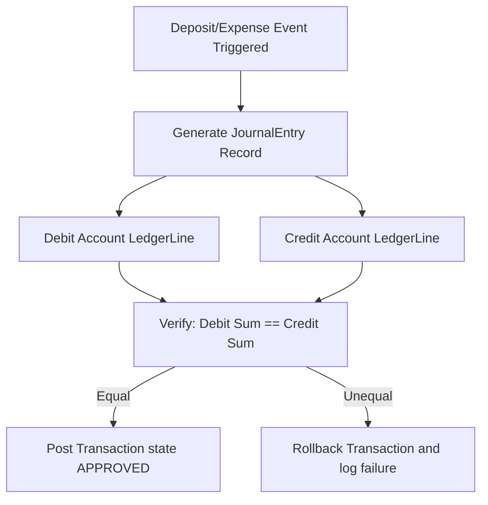

# Module Map & Service Architecture
## Document Path: `docs/architecture/module-map.md`

This document details the module directory map, dependency boundaries, service architecture specs, and double-entry accounting models for the Cooperative Society ERP system.

---

## 1. Module Architecture (Directory Map)

The Next.js App Router structure separates the presentation layer from domain services.

```
co-operative-soceity/
├── docs/                        # Architecture & requirements specifications
├── prisma/                      # Database schema blueprints and migrations
│   ├── schema.prisma            # Active Prisma definitions
│   └── seed.ts                  # Mock data seeding profile
├── src/
│   ├── app/                     # Next.js App Router folders
│   │   ├── (auth)/              # Login, password reset routes
│   │   ├── (dashboard)/         # Main view shell
│   │   │   ├── members/         # Member list & nominee forms
│   │   │   ├── deposits/        # Bulk bill entries & receipts
│   │   │   ├── expenses/        # Expense logs & approval views
│   │   │   ├── bank/            # Joint signature bank accounts
│   │   │   └── reports/         # PDF downloads & sheets exports
│   │   ├── api/                 # Next.js API endpoints
│   │   ├── layout.tsx           # Global root layouts
│   │   └── page.tsx             # Gateway routing handler
│   ├── components/              # Shared UI component blocks
│   │   ├── common/              # Navbar, Sidebar, dropdown controls
│   │   ├── ui/                  # Shadcn primitives
│   │   └── widgets/             # Charts, metrics dashboard widgets
│   ├── lib/                     # System utilities
│   │   ├── db.ts                # Prisma connection pool initialization
│   │   ├── auth.ts              # NextAuth configurations
│   │   └── utils.ts             # Formatting utilities
│   ├── services/                # Backend domain services layer
│   │   ├── MemberService.ts     # Business logic for member accounts
│   │   ├── DepositService.ts    # Weekly bill records processing
│   │   ├── ExpenseService.ts    # Balance checking & multi-step approvals
│   │   ├── AccountingService.ts # Double-entry ledgers & dividends
│   │   └── AuditService.ts      # Action monitoring log generation
│   └── styles/                  # Styling files
│       └── globals.css          # Tailwind variables
```

---

## 2. Service Architecture

The ERP segregates logic into domain services. These services handle transactional boundaries and prevent controllers from executing query operations directly.

### 2.1 Service Classes

#### `MemberService`
*   **Method `registerMember(data, nomineeData)`**: Resolves database transactions. Inserts the member and nominee records, generates a unique Member ID, and locks the admission fee entry in cash-on-hand balances.
*   **Method `evaluateSuspensions()`**: Periodic system job. Checks for members with zero deposit items over 12 consecutive weeks, updating status fields to `SUSPENDED`.

#### `DepositService`
*   **Method `processBulkDeposit(memberId, paymentItems, officerId)`**: Executes database transaction blocks. Generates a parent `Deposit` record, calculates the shares equivalence count, inserts items, and generates digital money receipts.

#### `ExpenseService`
*   **Method `createExpenseRequest(data, accountantId)`**: Computes remaining balance values across target accounts. Rejects log submission if the value exceeds balances.
*   **Method `approveExpense(expenseId, approverId)`**: Updates transaction state values to `APPROVED` and decreases targeted bank/cash accounts.

#### `AccountingService`
*   **Method `calculateProjectDividends(projectId)`**: Queries project parameters, matches ratio pools, and posts dividend transactions to ledger tables.
*   **Method `executeAnnualClosing(fiscalYearId)`**: Verifies date boundaries, balances ledgers, and locks fiscal year records to prevent modification.

---

## 3. Double-Entry Accounting Architecture

The system runs a classic Double-Entry General Ledger backend system. No balance is altered without balancing debits and credits.



### Chart of Accounts Structure (Static Assets)
1.  **Assets**:
    *   `1010` - Cash on Hand
    *   `1020` - Bank Current Account
    *   `1030` - Fixed Deposits Fund
2.  **Liabilities**:
    *   `2010` - Member Savings Accounts
    *   `2020` - Project Capital Holdings
3.  **Equity**:
    *   `3010` - Business Development Fund (95% Dividend Target)
    *   `3020` - Poor & Destitute Fund (2.5% Target)
    *   `3030` - Sports & Entertainment Fund (2.5% Target)
4.  **Revenues & Expenses**:
    *   `4010` - Admission Fee Revenues
    *   `5010` - Operational Expenses (Office Rent, transport, etc.)

### Transaction Allocation Examples

#### 1. Member Registration Deposit
*   **Debit**: `1010 - Cash on Hand` (+5,000 BDT)
*   **Credit**: `4010 - Admission Fee Revenues` (+5,000 BDT)

#### 2. Weekly Member Subscription Payment
*   **Debit**: `1010 - Cash on Hand` (+1,000 BDT)
*   **Credit**: `2010 - Member Savings Accounts` (+1,000 BDT)
*   *Note*: The system also increments the member's `ShareRecord` by 1.0.

#### 3. Expense Settlement (Office Rent)
*   **Debit**: `5010 - Operational Expenses` (+10,000 BDT)
*   **Credit**: `1020 - Bank Current Account` (-10,000 BDT)
