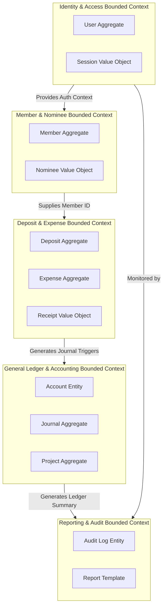
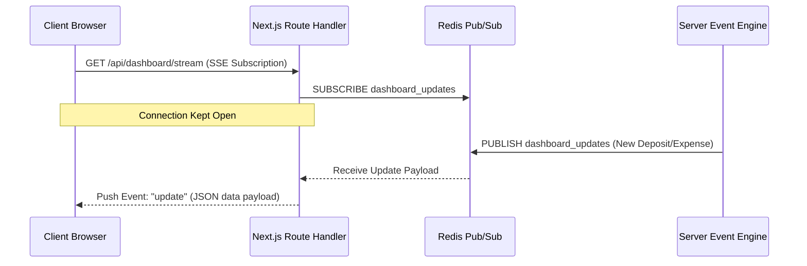
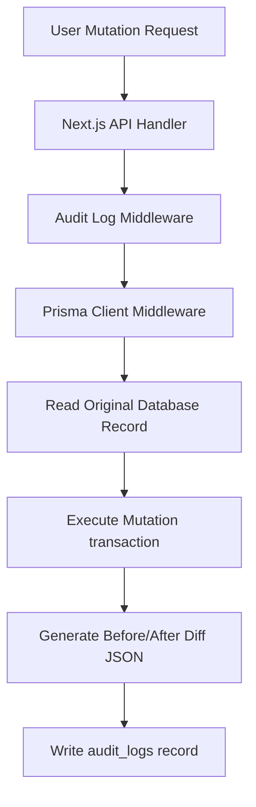

# System Architecture Specification
## Document Path: `docs/architecture/system-architecture.md`

This document details the high-level system architecture, bounded contexts, API design strategy, realtime updates strategy, and auditing framework for the Cooperative Society ERP system.

---

## 1. High-Level System Architecture

The application is structured as a production-grade monolithic web application using Next.js App Router, packaged in Docker, and orchestrated on a target server using Dokploy.

```mermaid
graph TD
    subgraph Client Layer
        Browser[Web Browser / Client UI]
    end

    subgraph Application Layer (Next.js App Router)
        UI[React Components / Shadcn UI]
        Router[App Router / Middleware]
        API[API Route Handlers]
        Services[Domain Services Layer]
        Auth[NextAuth v5 Provider]
    end

    subgraph Data & Caching Layer
        Redis[Redis Cache & Pub/Sub]
        DB[(PostgreSQL Database)]
        ORM[Prisma Client]
    end

    subgraph Infrastructure
        Docker[Docker Container Engine]
        Dokploy[Dokploy Manager]
    end

    Browser <--> |HTTPS / JSON / SSE| Router
    Router --> UI
    Router --> Auth
    Router --> API
    API --> Services
    Services --> ORM
    Services --> Redis
    ORM --> DB
    Docker --> Dokploy
```

### Stack Components & Integration
*   **Frontend**: Next.js App Router, Tailwind CSS, Shadcn UI, React Icons. Client state is managed locally via React Context/Zustand; server components fetch data directly or delegate to local API routes.
*   **Authentication**: NextAuth v5 (Auth.js) implements session management and controls Route Guards using Next.js middleware.
*   **Database Interface**: Prisma ORM maps database entities to TypeScript types, performing static schema migrations and query execution.
*   **Caching & Messaging**: Redis handles session stores, rate-limiting, and Pub/Sub event queues.
*   **Deployment Hosting**: Containerized via multi-stage Docker configurations and managed through Dokploy.

---

## 2. Bounded Contexts

To isolate domain boundaries and minimize coupling, the system is partitioned into five Bounded Contexts.



### Domain Boundary Maps
1.  **Identity & Access Management (IAM)**: Encapsulates user accounts, password resets, logins, and Role-Based Access Control (RBAC) validations.
2.  **Membership & Nominee**: Manages member details, phone unique validation rules, and nominee connections.
3.  **Deposit, Share, & Expense (Finance)**: Handles weekly/monthly bill records, receipt file attachments, share calculations, late fee penalties, and expense logging with balance checks.
4.  **General Ledger & Accounting**: Implements double-entry ledger bookkeeping, project capital pools, ratio-based profit calculations, and annual fiscal year dates locking.
5.  **Operations & Audit**: Tracks user events (audit log database logs) and handles PDF/CSV exports.

---

## 3. API Strategy

The system enforces a RESTful API layout using Next.js route handlers.

### Endpoint Matrix

| Action | HTTP Route | Auth Level Required | Input Format | Output Format | Description |
| :--- | :--- | :--- | :--- | :--- | :--- |
| **Auth** | `POST /api/auth/login` | Public | JSON (`email`, `password`) | JSON + Session Cookie | Log in user session |
| **Auth** | `POST /api/auth/logout` | Authenticated | None | JSON | Terminate user session |
| **Member** | `POST /api/members` | Super Admin, Accountant | JSON (Member Profile + Nominee) | JSON (`id`, status code) | Create new member |
| **Deposit** | `POST /api/deposits/bulk` | Collection Officer | JSON (Member ID, array of payments) | JSON + Slip Metadata | Bulk record payment |
| **Expense** | `POST /api/expenses` | Accountant | Multipart/Form-Data (fields + receipt img) | JSON (status pending) | Log pending expense |
| **Expense** | `PUT /api/expenses/:id/approve` | Super Admin | None | JSON (approved state) | Approve expense ledger |
| **Transfer** | `POST /api/bank/transfer` | Super Admin, Accountant | JSON (from, to, amount, signatures) | JSON | Bank transfer record |
| **Reports** | `GET /api/reports/:type` | Super Admin, Accountant | Query Params (`format`, `startDate`, `endDate`) | File Stream (PDF/CSV) | Export report file |

### Design Rules
*   **Idempotency**: Data modifying endpoints (e.g. bulk billing inputs) must validate header keys to prevent duplicate post actions.
*   **Error Schemas**: Standardize exception payloads as:
    ```json
    {
      "success": false,
      "code": "ERROR_CODE",
      "message": "সদস্যের পর্যাপ্ত ব্যালেন্স নেই"
    }
    ```

---

## 4. Realtime Strategy

The ERP uses Server-Sent Events (SSE) alongside Redis Pub/Sub to push dashboard updates without page reloads.



### Event Streaming Protocols
*   **Redis Pub/Sub**: In multi-instance Docker environments, instances subscribe to Redis topic updates to ensure cache synchronization.
*   **Server-Sent Events (SSE)**: Lightweight server-to-client streaming push protocol for updating total member metrics, share pools, cash balances, and collection charts.
*   **Fallbacks**: Client dashboards automatically fall back to standard HTTP polling queries every 60 seconds if SSE connections drop.

---

## 5. Audit Architecture

The audit trail is implemented via database triggers and application middleware to block unauthorized schema updates and maintain historic records.



### Auditing Rules
*   **Non-Repudiation**: The database table `audit_logs` must exclude update or delete permissions for all non-system database connections.
*   **Before/After Diff Model**: Logs must capture the full diff history using JSONB formats.
*   **Captured Metadata**: Capture IP address, user profile ID, transaction timestamp, context path, and action classifications (INSERT, UPDATE, DELETE).
