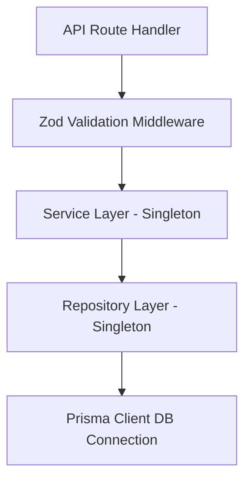
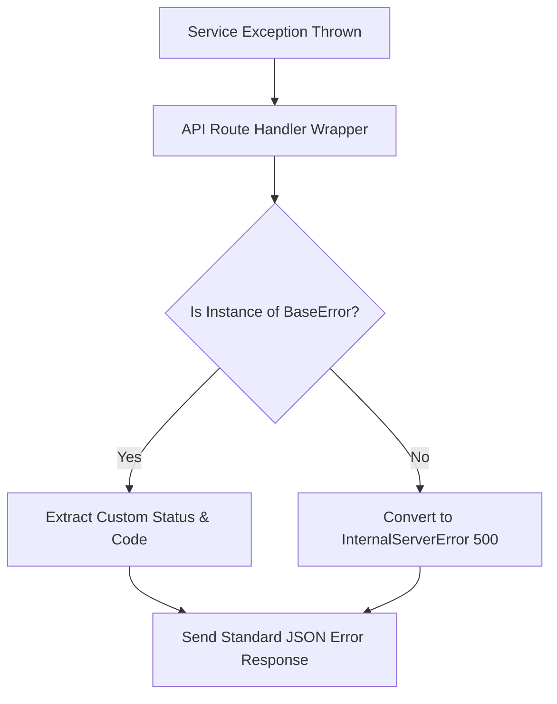
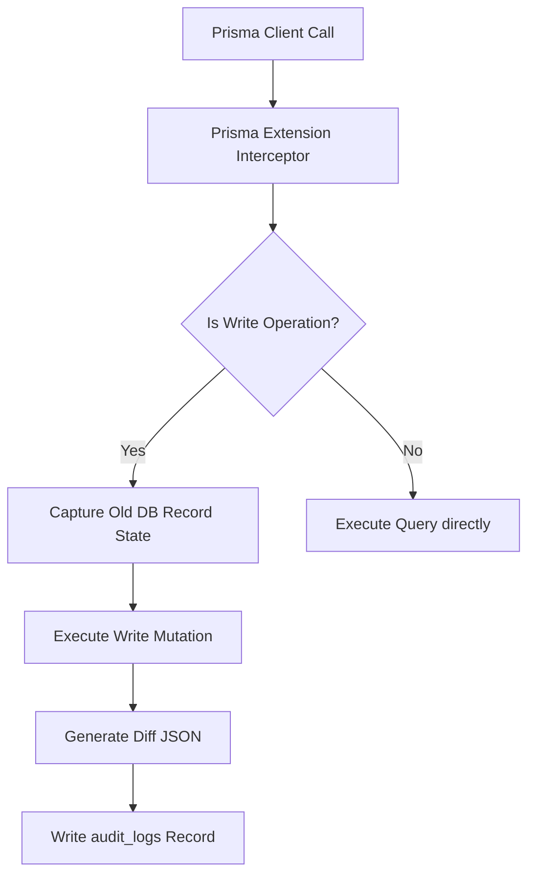

# Backend Architecture Blueprint
## Document Path: `docs/backend/backend-architecture.md`

This document details the core backend architecture, layering patterns, validation strategies, exception handling models, logging layouts, and event-auditing integrations for the Cooperative Society ERP system.

---

## 1. Backend Folder Structure

The system employs a layered structure isolating database interfaces, business services, request validation, and API routes.

```
src/
├── app/
│   └── api/                    # Route Handlers (Presentation Layer)
├── backend/                    # Core Backend Domain System
│   ├── errors/                 # Exception hierarchy definitions
│   │   ├── BaseError.ts        # Abstract custom error class
│   │   └── AppErrors.ts        # Concrete instances (ValidationError, NotFoundError)
│   ├── logger/                 # Logging configurations
│   │   └── index.ts            # Winston/Pino logger setup
│   ├── middlewares/            # Route level wrappers
│   │   ├── errorHandler.ts     # Global request error capturer
│   │   ├── validateBody.ts     # Zod payload validator
│   │   └── auditTracker.ts     # Request monitoring log interceptor
│   ├── repositories/           # Repository Layer (Prisma Wrappers)
│   │   ├── BaseRepository.ts   # Common CRUD and transaction wrappers
│   │   └── interfaces/         # Repository contracts definitions
│   ├── services/               # Service Layer (Business Logic)
│   │   ├── BaseService.ts      # Shared service utils
│   │   └── interfaces/         # Service contracts definitions
│   └── validations/            # Validation Layer (Zod Schemas)
│       └── common.ts           # Standard shared validations (UUIDs, pagination)
```

---

## 2. Service & Repository Layers



### 2.1 Service Layer
*   **Encapsulation**: The Service Layer hosts all business calculations, verification logic, and orchestrates transactions. It must not directly read request objects or write HTTP response headers.
*   **Singleton Pattern**: All services are registered as singletons to minimize memory footprints:
    ```typescript
    // Example Structural Interface
    export interface IMemberService {
      registerMember(data: unknown): Promise<MemberResult>;
    }
    ```

### 2.2 Repository Layer
*   **Decoupled Queries**: The Repository Layer abstracts Prisma queries. Business modules read repositories instead of calling raw Prisma queries, allowing query caching strategies (via Redis) to remain separated from business services.
*   **Transactional Boundary**: Transactions are managed using Prisma's `$transaction` utility, exposed through repositories as unit-of-work functions.

---

## 3. Validation Layer (Zod)

Payload validation is executed before requests reach service layers.

### Validation Principles
1.  **Strict Type Checking**: Schemas enforce exact properties, rejecting unexpected parameters (`z.strict()`).
2.  **BDD Style String Formats**: Phone validation uses exact expression structures matching Bangladeshi phone operators: `/^(?:\+88|88)?(01[3-9]\d{8})$/`.
3.  **Decimal Precision**: Transaction totals are parsed as integers to check for BDT paisa compliance.

---

## 4. Error Handling Model

The system runs a structured global exception catching pipeline.



### 4.1 Custom Error Hierarchy
*   **`BaseError`**: Abstract class inheriting from native `Error`, mapping:
    *   `statusCode`: HTTP status equivalent.
    *   `errorCode`: Unique uppercase string identifier (e.g. `INSUFFICIENT_FUNDS`).
    *   `errorDetails`: Key-value map containing field-level exceptions (for Zod outputs).
*   **App Errors**:
    *   `ValidationError` (400)
    *   `AuthenticationError` (401)
    *   `ForbiddenError` (403)
    *   `NotFoundError` (404)
    *   `ConflictError` (409)

---

## 5. Logging System

The logging framework utilizes **Winston** (or **Pino**) to ensure fast logging with minimal overhead.

### Logging Configurations
*   **Log Levels**: `error`, `warn`, `info`, `http`, `debug`.
*   **Log Format (Console)**: Colorized, human-readable line format in development environments:
    `[2026-06-15 16:40:00] [INFO] [MemberService]: Registered Member SOM-001`
*   **Log Format (Production)**: Structured JSON format streamed to standard output files to enable parsing by container metrics engines.
*   **Data Masking**: Log write hooks must scan parameters and redact keys like `password`, `passwordHash`, `token`, and `otp`.

---

## 6. Database Audit Integration

Database auditing is performed using Prisma middleware or client extensions to intercept operations automatically.



### Audit Logging Mechanism
1.  **Prisma Interceptors**: Implement a Prisma client extension capturing `create`, `update`, and `delete` query runs.
2.  **Audit Extraction**:
    *   For updates: Read current state, execute write, compare values to compile a JSON patch block.
    *   For deletions: Backup final values before database removal (or soft delete update).
3.  **Bypassing**: Exclude logging for reads, linter validation queries, and audit log write operations themselves to avoid infinite loops.
