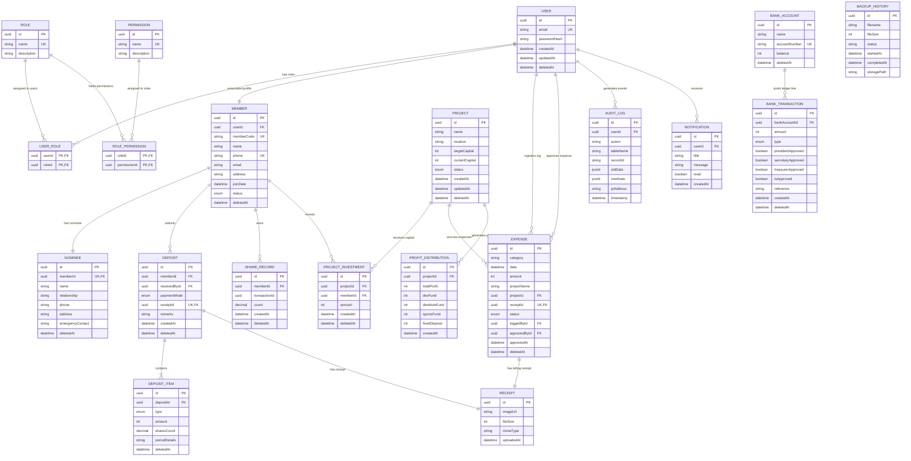

# Database Entity-Relationship Diagram (ERD)
## Document Path: `docs/database/erd.md`

This document outlines the detailed Entity-Relationship Diagram (ERD) mapping all database models, attributes, keys, and relational constraints for the Cooperative Society ERP system.

---

## 1. Entity-Relationship Diagram (ERD)

---

## 2. Key Database Design Patterns

### 2.1 Soft Delete Architecture
Every core domain model (e.g. `User`, `Member`, `Deposit`, `Expense`, `Project`) contains a nullable `deletedAt` DateTime column.
*   **Active records**: `deletedAt IS NULL`.
*   **Soft deleted records**: `deletedAt IS NOT NULL` (stores deletion timestamp).
*   **Prisma implementation**: Read queries must apply `where: { deletedAt: null }` filter conditions unless checking historical logs.

### 2.2 Financial Precision
All currency columns (e.g. `amount`, `balance`, `totalProfit`) are stored as **Integers** representing BDT paisa/cents. This avoids IEEE 754 floating-point rounding errors during financial balancing calculations.
*   1 BDT = 100 Paisa (e.g. 5,000 BDT is stored in database as `500000`).

### 2.3 System Audit Log
The `AuditLog` table stores JSONB snapshots (`oldData` and `newData`) containing full record diffs, allowing rollback capabilities and satisfying fraud detection requirements.
