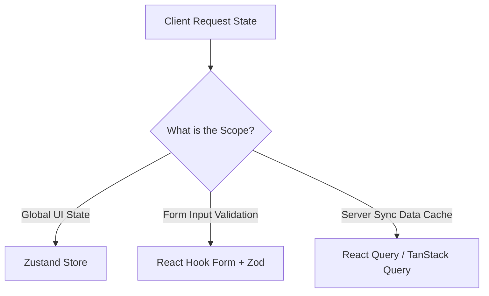

# Frontend Architecture Blueprint
## Document Path: `docs/frontend/frontend-architecture.md`

This document outlines the client-side system architecture, routing paths, component layout hierarchies, state management, design tokens, and navigation flows for the Cooperative Society ERP system.

---

## 1. Route Map

The application uses the **Next.js App Router** structure. Route groups are used to isolate authentication pages from the main dashboard shell.

```
src/app/
├── (auth)/                     # Auth Route Group (Unauthenticated Layout)
│   ├── login/                  # /login (Credential Login Screen)
│   └── reset-password/         # /reset-password (OTP Reset Verification)
├── (dashboard)/                # Dashboard Shell Group (Authenticated Layout)
│   ├── page.tsx                # /dashboard (Real-time charts widget)
│   ├── members/                # /members (Member ledger directories)
│   │   ├── new/                # /members/new (Registration entry form)
│   │   └── [id]/               # /members/[id] (Member details + Nominee info)
│   ├── deposits/               # /deposits (Transaction billing inputs)
│   │   └── receipts/           # /deposits/receipts (Money receipts list)
│   ├── expenses/               # /expenses (Expense listing + logs form)
│   ├── bank/                   # /bank (Multi-bank signatures panel)
│   └── reports/                # /reports (Download formats console)
├── layout.tsx                  # Global HTML Shell & Theme Providers
└── page.tsx                    # Route landing logic (redirects to /login or /dashboard)
```

---

## 2. Layout & Shell Architecture

### 2.1 Dashboard Layout Shell
The authenticated layout shell provides a responsive grid layout containing:
*   **Sidebar Navigation**: Dynamic menu lists adapting to user roles (e.g. hides user management screens from accountants).
*   **Top Navbar**: Displays breadcrumbs navigation, real-time alert notifications dropdown, user profile dropdown, and logout trigger.
*   **Content Frame**: Wrapper handling loading states, transitions, and scroll areas.

```mermaid
graph TD
    subgraph Root Layout Shell
        A[NextAuth Session Provider] --> B[Theme Provider ThemeProvider]
        B --> C[Toast Notification Provider]
    end

    subgraph Authenticated Shell (Dashboard Layout)
        D[Sidebar Navigation Panel]
        E[Top Navbar Header]
        F[Dynamic Content Area]
    end

    C --> Authenticated_Shell
```

---

## 3. Component Hierarchy

The frontend follows atomic component structures grouped by domain boundaries:

```
src/components/
├── ui/                         # Shadcn UI base primitives (Buttons, Dialogs, Inputs)
├── common/                     # Cross-page shell layouts
│   ├── Sidebar.tsx             # Collapsible sidebar list
│   ├── Navbar.tsx              # Header containing user actions
│   └── ErrorBoundary.tsx       # Custom layout error catches
├── widgets/                    # Analytical widgets for dashboard page
│   ├── MetricsCard.tsx         # Render counts (e.g. Total Members, cash)
│   └── CollectionChart.tsx     # Monthly collection-expense bar chart
└── forms/                      # Validated forms wrapping fields
    ├── LoginForm.tsx           # Credentials form with Zod schema
    ├── MemberForm.tsx          # Member + Nominee creation wizard
    └── ExpenseForm.tsx         # Billing logs + document upload
```

---

## 4. Client State Management

The application utilizes three distinct state strategies based on persistence needs:



### 4.1 Global UI State (Zustand)
*   Used for light, ephemeral interface adjustments.
*   Example: Sidebar toggle settings, active notifications count, temporary search keys.

### 4.2 Server Cache & Synced State (React Query / TanStack Query)
*   Caching API data, background polling, and optimistic UI mutations.
*   Example: Reloading bank balances automatically upon expense approvals, paginating member lists.

### 4.3 Form State (React Hook Form)
*   Captures user inputs, validating types via Zod schemas before API submissions.

---

## 5. Theme System (Shadcn & Tailwind)

The visual theme system enforces CSS variable configurations within `tailwind.config.js` to define color variables, typography scales, and visual modes.

### 5.1 Color Variables Map
```css
:root {
  /* Harmony Palette - Sleek Dark/Light HSL Colors */
  --background: 0 0% 100%;
  --foreground: 222.2 84% 4.9%;
  --primary: 142.1 76.2% 36.3%;       /* Professional Emerald Green */
  --primary-foreground: 355.7 100% 97.3%;
  --muted: 210 40% 96.1%;
  --muted-foreground: 215.4 16.3% 46.9%;
  --destructive: 0 84.2% 60.2%;       /* Warning red for insufficient balances */
  --border: 214.3 31.8% 91.4%;
  --radius: 0.5rem;                   /* Modern rounded borders scale */
}
```

### 5.2 Accessibility Constraints
*   **Focus Ring**: Every interactive Shadcn element must project a `focus-visible:ring-2` class configuration to satisfy keyboard navigation rules.
*   **Contrast Bounds**: Text colors must map variables ensuring WCAG Level AA contrast ratios are preserved.

---

## 6. Role-Based Navigation Menu System

The navigation builder queries the authenticated user's profile and filters sidebar elements dynamically:

*   **Super Admin Menu**: Show Dashboard, Members, Deposits, Expenses, Bank Accounts, Reports, System Logs.
*   **Accountant Menu**: Show Dashboard, Members (view-only link), Deposits, Expenses (creation/list only), Bank Accounts (view-only), Reports.
*   **Collection Officer Menu**: Show Dashboard, Deposits (creation only), Reports (view-only collection reports).
*   **General Member Menu**: Show Dashboard (personal summary page), Personal Passbook Statement.
