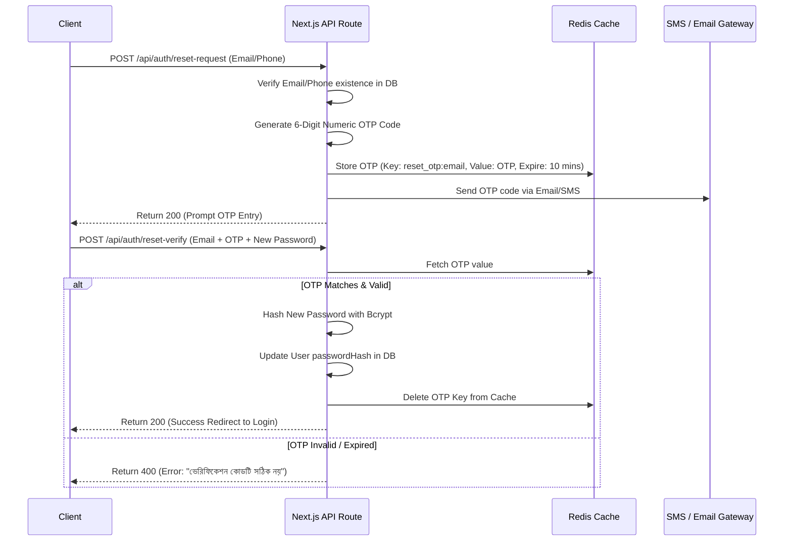

# Security Policy Specification
## Document Path: `docs/security/security-policy.md`

This document establishes the authentication architecture, session parameters, password recovery workflows, auditing rules, and network protection policies for the Cooperative Society ERP system.

---

## 1. Authentication Flow

The system uses **NextAuth v5 (Auth.js)** to process user logins.

```mermaid
sequenceDiagram
    participant U as Client Browser
    participant A as NextAuth Handler
    participant DB as PostgreSQL DB

    U->{A: POST /api/auth/callback/credentials (Email + Password)
    A->>DB: Query User where email = input
    alt User Not Found
        A-->>U: Return 401 (Error: "আপনার আইডি বা পাসওয়ার্ড ভুল")
    else User Found
        A: Compare passwordHash using bcrypt.compare()
        alt Hash Mismatch
            A-->>U: Return 401 (Error: "আপনার আইডি বা পাসওয়ার্ড ভুল")
        else Hash Matches
            A->>DB: Retrieve User Roles & Permissions
            A: Ingest Roles into Token Payload
            A-->>U: Set Secure HTTP-Only Cookie + Redirect
        end
    end
```

### Authentication Rules
*   **Hash Algorithm**: Passwords must be hashed using **bcrypt** with a minimum work factor (salt rounds) of 12.
*   **Account Lockouts**: If a user records 5 failed login attempts within 15 minutes, their IP address and account email must be locked programmatically in Redis cache for 15 minutes.
*   **Error Bounds**: Never indicate whether the email or password was the incorrect parameter. Use the uniform Bengali message: `"আপনার আইডি বা পাসওয়ার্ড ভুল"`.

---

## 2. Session Strategy

*   **Token Model**: The application uses encrypted JSON Web Tokens (JWT) for session management.
*   **Expiry Limits**:
    *   JWT Max Age: 8 hours (aligned with standard administrative shifts).
    *   Session Idle Timeout: Clear session cookie after 30 minutes of client inactivity.
*   **Cookie Configurations**: Session cookies must employ:
    *   `HttpOnly = true` (blocking JavaScript access and mitigating XSS risks).
    *   `Secure = true` (enforcing transmission only over HTTPS connections).
    *   `SameSite = Strict` (blocking CSRF cross-origin vectors).

---

## 3. Password Reset Flow



---

## 4. Audit Log Rules

The system must log all database write operations (INSERT, UPDATE, DELETE) inside the `AuditLog` table using JSONB difference mapping.

### Logged Events Schema

| Entity / Table | Operations | Captured Scope | Sensitivity Level |
| :--- | :--- | :--- | :--- |
| `Member` / `Nominee` | INSERT, UPDATE, DELETE | Full metadata, phone, address changes | Medium |
| `Deposit` / `DepositItem` | INSERT, DELETE | Transaction ID, Amount, Shares count | High |
| `Expense` | INSERT, UPDATE, DELETE | Amount, Project, Approval state changes | High |
| `BankAccount` / `BankTransaction`| INSERT, UPDATE | Balance variations, Signatures tracking | Critical |
| `User` / `UserRole` | INSERT, UPDATE, DELETE | User permissions mapping adjustments | Critical |

*   **Log Invariants**:
    *   Never log raw password strings or plain text verification tokens.
    *   Logs must contain Before (`oldData`) and After (`newData`) diff structures for database updates.

---

## 5. Security Policies

### 5.1 CORS & Security Headers
*   **CORS Configuration**: Restrict API calls using CORS. Only allow requests from designated domain names. Block wildcard requests (`Access-Control-Allow-Origin: *`).
*   **CSP (Content Security Policy)**: Implement strict script and styling sources:
    ```http
    Content-Security-Policy: default-src 'self'; script-src 'self'; style-src 'self' 'unsafe-inline'; img-src 'self' data:;
    ```
*   **Security Header Middleware**: Next.js route middleware must inject:
    *   `X-Frame-Options: DENY` (prevents clickjacking attacks).
    *   `X-Content-Type-Options: nosniff`.
    *   `Referrer-Policy: strict-origin-when-cross-origin`.

### 5.2 Infrastructure Audits
*   **Vulnerability Scanning**: CI/CD pipelines must execute dependency scans (`npm audit`) and block builds containing unresolved critical-level vulnerability packages.
*   **Docker Container Boundary**: Docker configurations must run node processes under a non-root group `node` to prevent container escape exploits.
